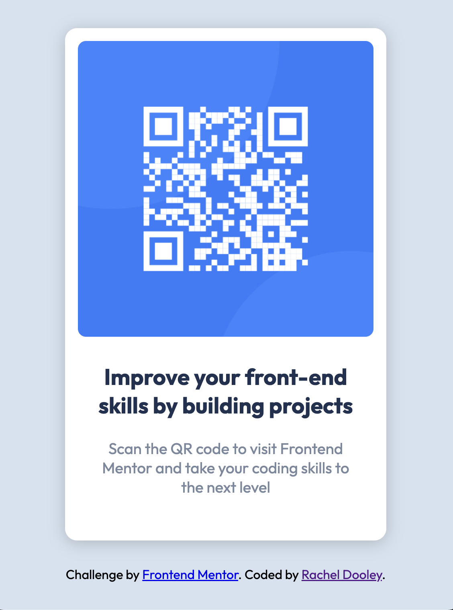

# Frontend Mentor - QR code component solution

This is a solution to the [QR code component challenge on Frontend Mentor](https://www.frontendmentor.io/challenges/qr-code-component-iux_sIO_H). Frontend Mentor challenges help you improve your coding skills by building realistic projects. 

## Table of contents

- [Overview](#overview)
  - [Screenshot](#screenshot)
  - [Links](#links)
  - [Built with](#built-with)
- [Author](#author)

### Screenshot

### Links

- Solution URL: https://github.com/Rae1821/qr-code-component
- Live Site URL: https://qr-component-main-challenge.netlify.app/

### Built with

- Semantic HTML5 markup
- CSS custom properties
- Mobile-first workflow

## Author

- Website - [Rachel Dooley](https://www.rachelandersondooley.com)
- Frontend Mentor - (https://www.frontendmentor.io/profile/Rae1821)
- Twitter - (https://www.twitter.com/racheladooley)

